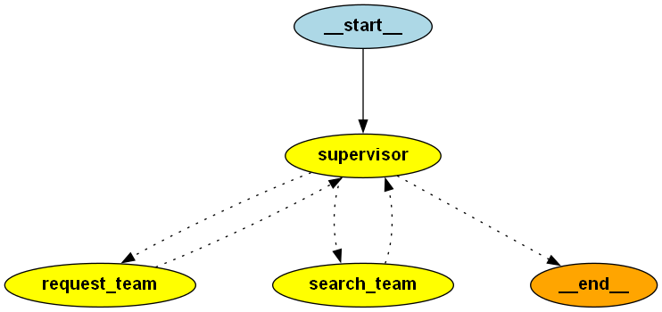

# RSS Feed Poller for Targeted RAG Pipelines

  

This project provides a small RSS feed poller that pulls article metadata from any site indexed by Google News. Instead of scraping full pages upfront, it collects only titles, summaries, and links so an LLM can decide which articles are worth deeper processing.

  

## How It Works

  

1. Poll Google News RSS feeds 
**DONE**

2. Extract minimal metadata (title, summary, link, timestamps) **DONE**

3. Store only new or updated entries 
**DONE**

4. Let an LLM choose which articles to fully scrape 
**IN PROGRESS**


6. Optionally fetch, convert to Markdown, chunk, and embed **TODO**

  

## Why Use It

  

This approach avoids scraping entire sites unless the metadata indicates the article is relevant, making RAG ingestion faster and more efficient.

  

## Project Structure

  

<!-- TREE_START -->
```
.
├── AGENTS.md
├── Dockerfile
├── LICENSE
├── README.Docker.md
├── README.md
├── assets
│   └── agent_teams_graph.png
├── compose.yaml
├── ingest.py
├── packages
│   ├── base_agents
│   │   ├── README.md
│   │   ├── pyproject.toml
│   │   └── src
│   │       ├── base_agents
│   │       │   ├── __init__.py
│   │       │   └── base_agents.py
│   │       └── base_agents.egg-info
│   │           ├── PKG-INFO
│   │           ├── SOURCES.txt
│   │           ├── dependency_links.txt
│   │           ├── requires.txt
│   │           └── top_level.txt
│   ├── feed_agents
│   │   ├── README.md
│   │   ├── pyproject.toml
│   │   └── src
│   │       └── feed_agents
│   │           ├── __init__.py
│   │           └── feed_agents.py
│   ├── feedpoller
│   │   ├── pyproject.toml
│   │   └── src
│   │       ├── feedpoller
│   │       │   ├── __init__.py
│   │       │   └── feedpoller.py
│   │       └── feedpoller.egg-info
│   │           ├── PKG-INFO
│   │           ├── SOURCES.txt
│   │           ├── dependency_links.txt
│   │           ├── requires.txt
│   │           └── top_level.txt
│   └── process_data
│       ├── README.md
│       ├── pyproject.toml
│       └── src
│           └── process_data
│               ├── __init__.py
│               └── process_data.py
├── pyproject.toml
├── query.py
├── services
│   └── fastapi_app
│       ├── log
│       │   └── myapp.log
│       ├── pyproject.toml
│       └── src
│           └── fastapi_app
│               └── main.py
├── uv.lock
└── var
    └── data
        ├── Anasdaq_com
        │   ├── 20260918_001730.json
        │   ├── document
        │   │   └── 20260918_001730.json
        │   ├── processed
        │   │   └── 20260918_001730.json
        │   └── state.json
        ├── bbc_com
        │   ├── 20260515_183820.json
        │   └── state.json
        └── reuters_com
            ├── 20260515_183846.json
            └── state.json

29 directories, 47 files
```
<!-- TREE_END -->
